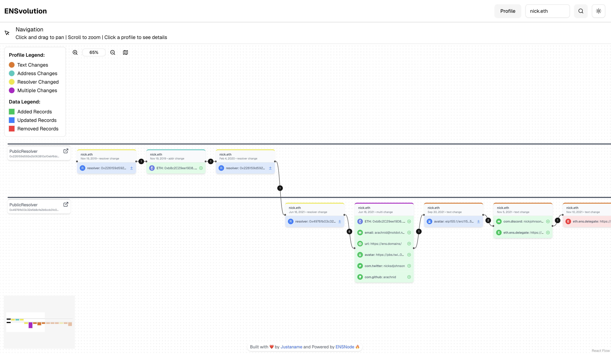

# ENSvolution - Visualize ENS Profile Evolution

ENSvolution is an interactive tool for visualizing the evolution of Ethereum Name Service (ENS) profiles over time. It offers a comprehensive timeline view of how ENS records change, helping users understand the history and development of ENS names.


## Overview

ENSvolution leverages the powerful indexing capabilities of [ENSNode](https://ensnode.io) to create visual timelines showing the complete history of an ENS name's records. The application visualizes:

- Text record additions, modifications, and deletions
- Address record changes across multiple blockchains
- Resolver contract changes
- Multi-record updates in a single transaction

By visualizing these changes chronologically, ENSvolution helps users gain insights into ENS name development patterns and understand the importance of transparent on-chain history.

## Features

- **Interactive Timeline**: Navigate through an ENS name's complete history with an intuitive flow chart
- **Color-coded Changes**: Easily identify different types of updates (additions, modifications, deletions)
- **Record Details**: Inspect the specific changes made in each update
- **Resolver Tracking**: See when and how resolver contracts changed
- **Transaction Links**: Direct links to Etherscan for viewing the original transactions

## Technology

ENSvolution is built with:

- **Next.js**: React framework for the frontend
- **ReactFlow**: Visualization library for the interactive timeline
- **ENSNode API**: Data source for comprehensive ENS history
- **TanStack Query**: Data fetching and caching
- **JustaName SDK**: Ready made ENS components and tools
- **ENSJs**: ENS Helper methods

## Why ENS History Matters

ENS names serve as digital identities in Web3, and understanding how these identities evolve over time is crucial for:

1. **Trust verification**: Seeing when and how records changed
2. **Identity research**: Understanding the development of digital identities
3. **Technical debugging**: Tracing issues with ENS resolution
4. **Ownership history**: Tracking resolver and record transitions

ENSvolution makes this history accessible and understandable to both technical and non-technical users.

## Roadmap

Future development plans include:
- **Off-chain Name Support**: Incorporating CCIP-Read and other off-chain resolution methods

## Acknowledgments

This project would not be possible without the exceptional work of the [ENSNode](https://ensnode.io) team, who have built a comprehensive indexing solution for ENS data. Their commitment to transparency and accessibility in the ENS ecosystem has enabled tools like ENSvolution to provide valuable insights into ENS name histories.

## Getting Started

To run ENSvolution locally:

```bash
# Clone the repository
git clone https://github.com/JustaName-id/ensvolution.git

# Install dependencies
bun i

# Start the development server
nx dev frontend
```

## Usage
Visit the application and enter an ENS name in the search bar to visualize its evolution. Navigate through the timeline by:

- Clicking nodes to see detailed information
- Using the zoom controls to adjust the view
- Clicking the sidebar toggle to view comprehensive record details

## Contributing
Contributions are welcome! Please feel free to submit a Pull Request.
## License
ENSvolution is released under the MIT License.

ENSvolution is not affiliated with or endorsed by the Ethereum Name Service or the Ethereum Foundation.
